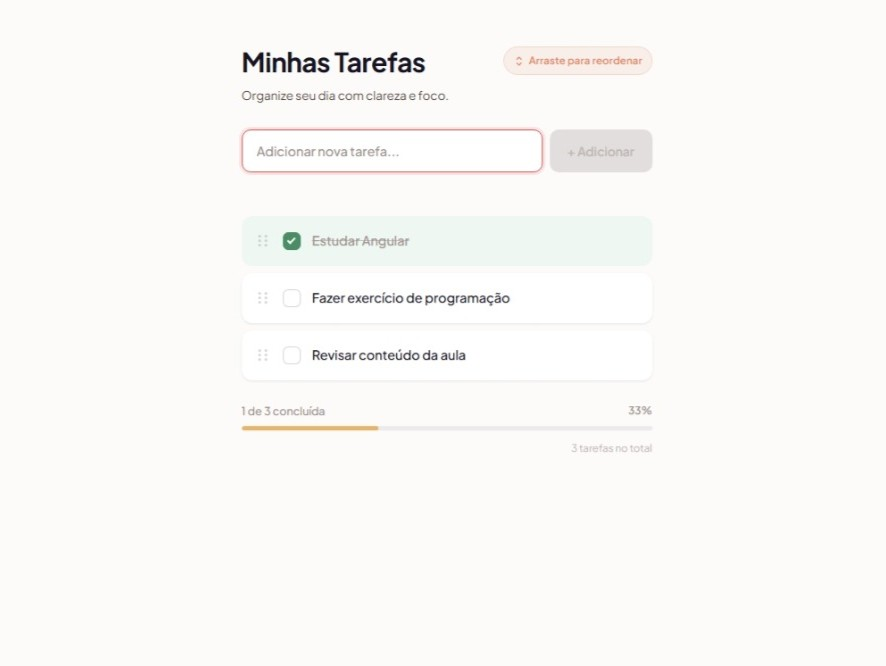

<div align="center">

# 📝 Angular To-Do List (Minhas Tarefas)

[](https://angular.io/)
[](https://www.typescriptlang.org/)
[](https://developer.mozilla.org/pt-BR/docs/Web/HTML)
[](https://developer.mozilla.org/pt-BR/docs/Web/CSS)
[]()

</div>

---

## 🐛 Sobre o projeto

O **Angular To-Do List** é uma aplicação web moderna e intuitiva de gerenciamento de tarefas do dia a dia. Desenvolvido como parte de uma atividade prática individual, o projeto tem como objetivo principal aplicar os conceitos fundamentais do framework Angular, proporcionando uma experiência fluida, reativa e organizada para o controle de pendências.

Desenvolvido durante o bootcamp da **WoMakersCode** 💜

---

## 📷 Screenshot

<div align="center">
  
</div>

---

## ✨ Funcionalidades

O aplicativo conta com recursos essenciais para garantir uma gestão de tarefas prática e eficiente:

- [x] **Visualização de Tarefas:** Exibição do título principal *"Minhas Tarefas"* acompanhado de uma lista inicial de itens cadastrados.
- [x] **Adição de Tarefas:** Campo de entrada de texto (`input`) intuitivo e botão *"Adicionar"* com validação integrada para impedir a inserção de tarefas vazias.
- [x] **Conclusão de Tarefas:** Caixas de seleção (`checkbox`) interativas que permitem marcar ou desmarcar tarefas, aplicando instantaneamente um estilo visual diferenciado (texto riscado).
- [x] **Remoção de Tarefas:** Botão de exclusão para remover de forma rápida qualquer item indesejado ou finalizado da lista.
- [x] **Contador Dinâmico:** Exibição em tempo real do número de tarefas concluídas na parte inferior da interface.

---

## 🛠️ Tecnologias Utilizadas

Este projeto foi construído utilizando as seguintes tecnologias e ferramentas:

* **[Angular](https://angular.io/)** — Framework principal para estruturação do Front-end.
* **[TypeScript](https://www.typescriptlang.org/)** — Linguagem base fortemente tipada.
* **[HTML5](https://developer.mozilla.org/)** — Marcação estrutural dos componentes.
* **[CSS3](https://developer.mozilla.org/)** — Estilização visual e responsividade da interface.
* **[Git & GitHub](https://github.com/)** — Controle de versão e hospedagem do repositório.

---

## 🚀 Como Executar o Projeto

Certifique-se de ter o **Node.js** e o **Angular CLI** instalados em sua máquina antes de prosseguir.

### 1. Clonar o repositório
Abra o seu terminal e execute o comando abaixo:
```bash
git clone https://github.com/MaluWhoo/Lista-de-Tarefas-em-Angular.git
```

### 2. Acessar a pasta do projeto
```bash
cd SEU-REPOSITORIO
```

### 3. Instalar as dependências
```bash
npm install
```

### 4. Executar a aplicação em ambiente de desenvolvimento
```bash
ng serve
```

### 5. Acessar no navegador
Abra o seu navegador de preferência e acesse o endereço:
```text
http://localhost:4200/
```
A aplicação recarregará automaticamente sempre que você alterar qualquer arquivo de código-fonte.

---

## 🧠 Aprendizados e Competências Praticadas

Durante o desenvolvimento deste projeto, foi possível consolidar e praticar conceitos essenciais do ecosistema Angular, tais como:

* **Arquitetura de Componentes:** Criação, modularização e estruturação correta de componentes reutilizáveis.
* **Data Binding:** Implementação prática de *Property Binding*, *Event Binding* e *Two-way Data Binding* através da diretiva `ngModel`.
* **Diretivas Estruturais e de Atributo:** Utilização de `*ngFor` para renderização de listas, `*ngIf` para renderização condicional e manipulação de classes/estilos dinâmicos.
* **Gestão de Estado Local:** Manipulação reativa de arrays no TypeScript para adicionar, atualizar e remover elementos instantaneamente na interface.


<!-- ## 📄 Licença e Autor

Desenvolvido com 💙 por **[Seu Nome / Seu Usuário]** como parte de uma atividade de aprendizado em desenvolvimento Front-end com Angular.

Sinta-se à vontade para utilizar, modificar e contribuir para este projeto! -->